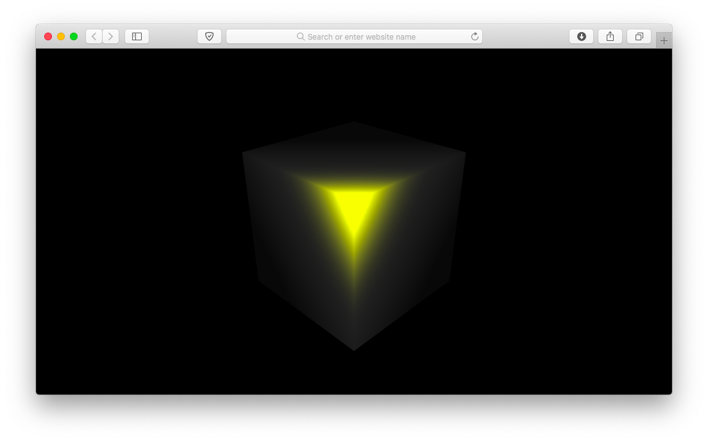

# webgl-phong
Demonstration of 3D cube with Phong shading. Written in pure javascript using Canvas and Webgl.


***

<h2> Running: </h2>

```
git clone https://github.com/vadrx/webgl-phong
```
Run index.html in your browser.